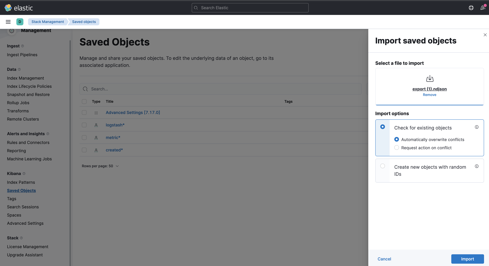

## Process to setup Jenkins Server with ELK stack

1. Run ``` terraform apply ``` in terraform_ec2_jenkins_vpc
1. Run ``` terraform apply ``` in terraform_ec2_jenkins

### Terraform output will produce links and commands


Wait about 5 minutes after successful Terraform Apply for installs to complete.

Then - Logon with public_ssh_link (aws security group rules should be scoped to local machine)

Get jenkins initial admin password with jenkins_admin_pw.

### Setup Jenkins


### Confirm Logstash working
While you wait confirm logstash is running by clicking kibana_link


Confirm sample logstash file setup worked by creating index


Should create these 3 index patterns


Go to discover and confirm data exists

![Discover(doc/Discover.png)


### Create Jenkins admin user


### Install HTTP Request plugin


### Create and Run pipeline using Jenkinsfile

/files/Jenkinsfile


### Import Report Canvas To Kibana



Set auto refresh


### Run Build and Watch Results


Confirm Jenkins job started


Confirm Jenkins job completed


#### Run Terraform Destroy to cleanup

``` terraform destroy ```

### Troubleshooting

See if logstash running ```curl http://localhost:9600```

Logstash logfiles ```cd /var/log/logstash```

Logstash logfiles ```tail -f -n 50 /var/log/logstash/logstash-plain.log```

Logstash input config files ```cd /etc/logstash/conf.d```

Logstash Install ```cd /usr/share/logstash```

Logstash Restart 

```
sudo service logstash start

ps aux | grep [l]ogstash

ps aux | grep [f]ilebeat

/usr/share/filebeat/bin/filebeat run -c /etc/filebeat/filebeat.yml

/usr/share/filebeat/bin/filebeat test config -c /etc/filebeat/filebeat.yml

tail -f -n 50 /var/log/filebeat/filebeat.log

sudo /usr/share/logstash/bin/logstash --config.test_and_exit -f /etc/logstash

kill -9 

tail -f -n 50 /var/log/jenkins/jenkins.log

```

vi /usr/share/logstash/Gemfile.lock 
search - /sinatra - should be 2.1

Logstash reinstall 

```
sudo apt-get remove logstash

sudo apt-get install logstash
```

Logstash http endpoint test message 

```
curl -H "content-type: application/json" -XPUT 'http://127.0.0.1:31311/jenkin-builds/' -d '{
"user": "thenewpne",
"run_date": "2022-02-26T15:15:15",
"message": "This is a test",
"durationString": "xxxx",
"absoluteUrl": "xxxxxx",
"startTimeInMillis": "12345",
"startTime": "xxxxx",
"BUILD_TAG": "xxxx"
}'
```